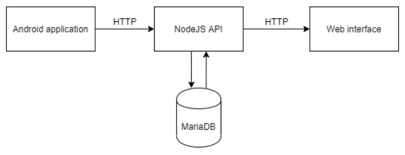
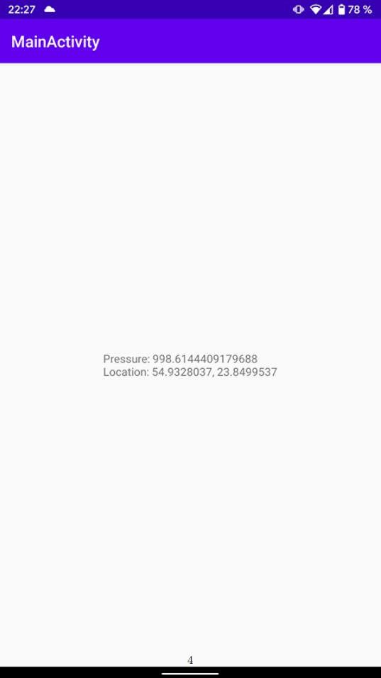
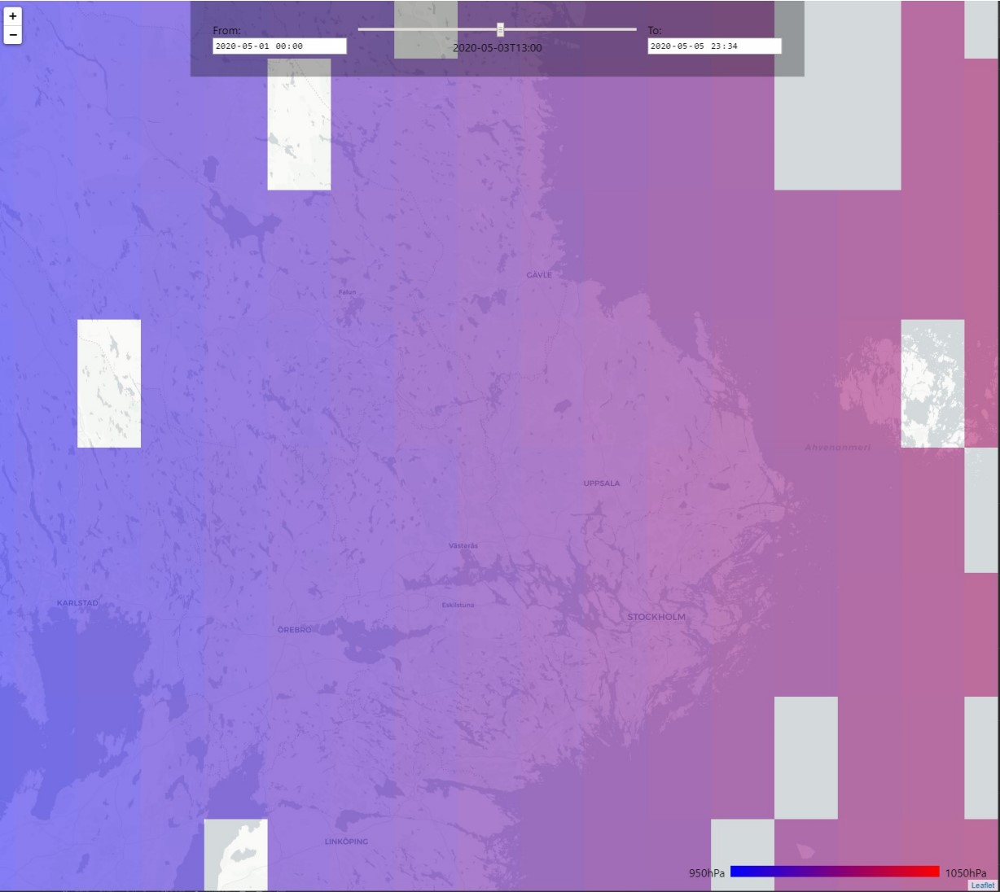

# Global barometer

## Introduction

The idea of the project is to build a real-time global atmospheric pressure monitoring tool. The tool can be used by meteorologist to analyse the data and make further weather predictions.  
The project consists of 3 parts: Rest API, Android app and web interface. The data is collected from the sensors of Android devices. The diagram
showing every part and how it connects to others is presented below.  
This project is tightly related to Ubiquitous Computing. The main part
of this project is the data, which can be collected from Android devices all
around the the world. Data collection is fully distributed. The more people
uses this application, the better and more precise results can be achieved.

## Android application
Android application was built using Kotlin programming language. It collects the user location and the barometer data and sends it to the API using
HTTP protocol. The data transmission happens every 10 seconds. The
transmitted data is also shown to the user indicating the successful delivery.
The screenshot of the app can be seen below.

## Rest API
Rest HTTP API was built using TypeScript programming language and
NodeJS runtime. It collects the data from Android devices and saves it into
MariaDB relational database. Docker was used to run the database.  
The API aggregates the data by coordinates and time before providing
it to web interface. Data aggregation increases the accuracy of the data in
the crowded areas and improves the performance of drawing the results on
the map. Data aggregation is done by grouping the data by hour as well as
assigning each result into 0.1x0.1 latitude/longitude coordinates squares and
averaging the results. However, aggregating the results that way makes the
squares not equal in the different places of the world, since the coordinates
distances cannot be straightly mapped to real world distances. However,
this kind of aggregation was chosen, because it could be implemented on
the database level and that increases the overall performance.

## Web interface

Web interface was built as a single-page application using JavaScript programming language and React framework. It has a map which shows the
real-time results as well as the historical data. The web interface provides
from and to date inputs as well as the slider, so that the meteorologist can
easily see animated atmospheric pressure changes in any desired place of the
world. The screenshot of the web interface can be seen below.

## Future work

In the future the Android app could be published to Google Play app store,
so that the app could be easily downloaded and used by anyone. That would
increase the active number of users and would make the project actually
work.  
Improvements in data aggregation could be made as well. Instead of
using coordinates distances, the real world distances could be used, so the
data is aggregated equally in the different parts of the world.  
Web interface could be improved, so that each aggregated data point
showed on the map, could have a popup which shows the number of data
points received as well as the maximum, the minimum and the average
result.

## Conclusions

During the project I learnt a lot about designing as well as building process
of the ubiquitous system. It was a lot of fun to build such project, which can
be used in real life. I think this project is a perfect working example of how
to solve problems using ubiquitous systems. It gathers the data from the
sensors distributed around the world and that way solves a real life problem
by visualizing the results on the map making future weather predictions
easier and more precise.